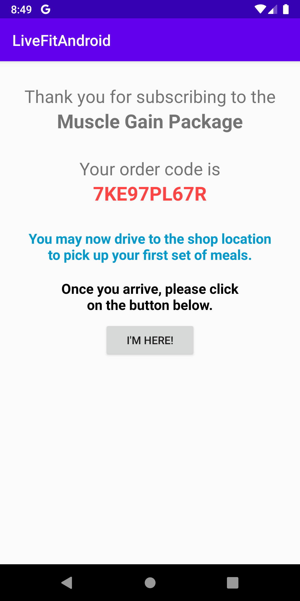

# Live Fit Food Ordering App for Android

### Mock ordering app for the livefitfood.ca website.
#### ***DISCLAIMER: This app was developed as an exercise in native Android mobile application development and is not in any way affiliated with the livefitfood.ca website or any of its mobile apps.*** 

#### Screenshots  

                              

#### Technologies/Concepts used

* User authentication/registration, storage, database services using the Firebase development platform.

* Multiple activity screens

* Location services

* RecyclerView

* CardView Layout of RecyclerView items/rows

* Event Listeners

* MediaStore for Camera photo taking function

* Passing of data between activities using intents

#### Features

* User login and registration using email/password or Google account.

* 2-way login: User may login as Admin or as a regular 

* Admin user-interface that will allow the following functions: 
  - adding of meal kits
  - adding of meals for an existing meal kit
  - adding of subcription plans

* Regular user-interface that will allow user to subscribe to mealkits.

#### Link to specification: <a href="./docs/MAD4006 - Project - Meal Delivery Apps, Revised.pdf" target="_blank">[App Specification]</a>

